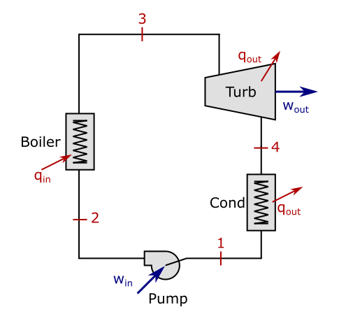

<div align="center">
  <a href="https://github.com/othneildrew/Best-README-Template">
    
  </a>

  <h1 align="center">CycleSolver</h1>

  <p align="center">
    <a href="https://github.com/vFilipaki/CycleSolver.jl/actions/workflows/CI.yml?query=branch%3Amaster"></a>
    <a href="https://vfilipaki.github.io/CycleSolver.jl/stable/"></a>
    <a href="https://codecov.io/gh/vFilipaki/CycleSolver.jl"></a>
    <a href="https://opensource.org/licenses/MIT"></a>
    <a href="https://mybinder.org/v2/gh/vFilipaki/CycleSolver.jl/v0.2.0"></a>
    <a href="https://juliahub.com/ui/Packages/General/CycleSolver"></a>
    <br />
    <br />
    Package for solving thermodynamic cycles in steady state 
    <br />
    <a href="https://vfilipaki.github.io/CycleSolver.jl/stable/"><strong>Explore the docs »</strong></a>
    <br />
    <br />
    <a href="https://github.com/vFilipaki/CycleSolver.jl#installation">How to install</a>
    ·
    <a href="https://github.com/vFilipaki/CycleSolver.jl#citations">How to cite this project</a>
    ·
    <a href="https://vfilipaki.github.io/CycleSolver.jl/dev/example1/">See examples</a>
</div>

---

The `CycleSolver.jl` package uses metaprogramming to provide a unique formatting structure for representing cycles and supplying already known properties. Based on this, the algorithm seeks to automatically discover other unknown properties of the system.

In addition to cycle solving, the presented package also offers result visualization features, generating tables and graphs to clearly illustrate cycle properties. This way, the tool allows for a quick and reliable analysis of thermodynamic cycles.

## Installation
To install `CycleSolver.jl`, use the Julia package manager. In Julia REPL, type `]` to enter Pkg REPL mode and run:

```julia
pkg> add CycleSolver
```
Alternatively, you can install it via the Pkg API:
```julia
julia> using Pkg

julia> Pkg.add("CycleSolver")
```
Additionally, you have the option to use the `CycleSolver.jl` package in an online environment, without the need for any local software installation. You can access it through the following link:
 * [CycleSolver Online](https://mybinder.org/v2/gh/vFilipaki/CycleSolver.jl/v0.2.0)

## Documentation

For information on how to use the package, see the [documentation](https://vfilipaki.github.io/CycleSolver.jl/dev/).

## Citations

How to cite this project:

```bibtex
@Misc{2023-FilipakiV-CycleSolver,
  author       = {V. Filipaki},
  title        = {{CycleSolver.jl} -- Solver for thermodynamic cycles},
  howpublished = {Online},
  month        = {August},
  year         = {2023},
  journal      = {GitHub repository},
  publisher    = {GitHub},
  url          = {https://github.com/vFilipaki/CycleSolver.jl},
}
```

## Example

### Ideal Simple Rankine Cycle

| Cycle data                               | 
|------------------------------------------|
|       |
> **Known properties:**
> * Temperature at the boiler outlet 250 °C;
> * Pressure before turbine 1000 kPa;
> * Pressure after turbine 10 kPa.

### Input code

```julia
  using CycleSolver
  
  @solve begin
      st3.T = 250 + 273
      st3.p = 1000
      st1.p = 10

      newCycle[]
          pump(st1, st2)
          boiler(st2, st3)
          turbine(st3, st4)
          condenser(st4, st1) 
  end

  PrintResults()
```

### Output:

<h2 align="center">1- CYCLE [water]</h2>
<table align="center">
  <thead>
    <tr class = "header headerLastRow">
      <th style = "color: black; text-align: center; padding: 8px; font-size: 130%;">State<br>Name</th>
      <th style = "color: black; text-align: center; padding: 8px; font-size: 130%;">T [K]</th>
      <th style = "color: black; text-align: center; padding: 8px; font-size: 130%;">P [kPa]</th>
      <th style = "color: black; text-align: center; padding: 8px; font-size: 130%;">h [kJ/kg]</th>
      <th style = "color: black; text-align: center; padding: 8px; font-size: 130%;">s [kJ/kg.K]</th>
      <th style = "color: black; text-align: center; padding: 8px; font-size: 130%;">x</th>
      <th style = "color: black; text-align: center; padding: 8px; font-size: 130%;">ṁ [kg/s]</th>
      <th style = "color: black; text-align: center; padding: 8px; font-size: 130%;">Mass-flux<br>fraction</th>
    </tr>
  </thead>
  <tbody>
    <tr>
      <td style = "text-align: left; padding: 8px; font-size: 130%;">st1</td>
      <td style = "text-align: left; padding: 8px; font-size: 130%;">318.956</td>
      <td style = "text-align: left; padding: 8px; font-size: 130%;">10.0</td>
      <td style = "text-align: left; padding: 8px; font-size: 130%;">191.806</td>
      <td style = "text-align: left; padding: 8px; font-size: 130%;">0.6492</td>
      <td style = "text-align: left; padding: 8px; font-size: 130%;">0.0</td>
      <td style = "text-align: left; padding: 8px; font-size: 130%;"></td>
      <td style = "text-align: left; padding: 8px; font-size: 130%;">1.0</td>
    </tr>
    <tr>
      <td style = "text-align: left; padding: 8px; font-size: 130%;">st2</td>
      <td style = "text-align: left; padding: 8px; font-size: 130%;">318.989</td>
      <td style = "text-align: left; padding: 8px; font-size: 130%;">1000.0</td>
      <td style = "text-align: left; padding: 8px; font-size: 130%;">192.806</td>
      <td style = "text-align: left; padding: 8px; font-size: 130%;">0.6492</td>
      <td style = "text-align: left; padding: 8px; font-size: 130%;"></td>
      <td style = "text-align: left; padding: 8px; font-size: 130%;"></td>
      <td style = "text-align: left; padding: 8px; font-size: 130%;">1.0</td>
    </tr>
    <tr>
      <td style = "text-align: left; padding: 8px; font-size: 130%;">st3</td>
      <td style = "text-align: left; padding: 8px; font-size: 130%;">523.0</td>
      <td style = "text-align: left; padding: 8px; font-size: 130%;">1000.0</td>
      <td style = "text-align: left; padding: 8px; font-size: 130%;">2942.79</td>
      <td style = "text-align: left; padding: 8px; font-size: 130%;">6.9258</td>
      <td style = "text-align: left; padding: 8px; font-size: 130%;"></td>
      <td style = "text-align: left; padding: 8px; font-size: 130%;"></td>
      <td style = "text-align: left; padding: 8px; font-size: 130%;">1.0</td>
    </tr>
    <tr>
      <td style = "text-align: left; padding: 8px; font-size: 130%;">st4</td>
      <td style = "text-align: left; padding: 8px; font-size: 130%;">318.956</td>
      <td style = "text-align: left; padding: 8px; font-size: 130%;">10.0</td>
      <td style = "text-align: left; padding: 8px; font-size: 130%;">2193.78</td>
      <td style = "text-align: left; padding: 8px; font-size: 130%;">6.9258</td>
      <td style = "text-align: left; padding: 8px; font-size: 130%;">0.8369</td>
      <td style = "text-align: left; padding: 8px; font-size: 130%;"></td>
      <td style = "text-align: left; padding: 8px; font-size: 130%;">1.0</td>
    </tr>
  </tbody>
</table>

<br>

<div align="center">
    
</div>

<br>

<h3 align="center">Cycle Properties:</h3>

<table align="center">
  <thead>
    <tr class = "header headerLastRow">
      <th style = "color: black; text-align: center; padding: 11px; font-size: 130%;"></th>
      <th style = "color: black; text-align: center; padding: 11px; font-size: 130%;">Total</th>
      <th style = "color: black; text-align: center; padding: 11px; font-size: 130%;">Component</th>
      <th style = "color: black; text-align: center; padding: 11px; font-size: 130%;">Value</th>
    </tr>
  </thead>
  <tbody>
    <tr>
      <td style = "text-align: left; padding: 11px; font-size: 130%;">qin<BR>Q̇in</td>
      <td style = "text-align: left; padding: 11px; font-size: 130%;">2749.9849 kJ/kg<BR>0.0 kW</td>
      <td style = "text-align: left; padding: 11px; font-size: 130%;">boiler:<BR>   st2 &gt;&gt; st3</td>
      <td style = "text-align: left; padding: 11px; font-size: 130%;">2749.9849 kJ/kg<BR></td>
    </tr>
    <tr>
      <td style = "text-align: left; padding: 11px; font-size: 130%;">qout<BR>Q̇out</td>
      <td style = "text-align: left; padding: 11px; font-size: 130%;">2001.9783 kJ/kg<BR>0.0 kW</td>
      <td style = "text-align: left; padding: 11px; font-size: 130%;">condenser:<BR>   st4 &gt;&gt; st1</td>
      <td style = "text-align: left; padding: 11px; font-size: 130%;">2001.9783 kJ/kg<BR></td>
    </tr>
    <tr>
      <td style = "text-align: left; padding: 11px; font-size: 130%;">win<BR>Ẇin</td>
      <td style = "text-align: left; padding: 11px; font-size: 130%;">1.0 kJ/kg<BR>0.0 kW</td>
      <td style = "text-align: left; padding: 11px; font-size: 130%;">pump:<BR>   st1 &gt;&gt; st2</td>
      <td style = "text-align: left; padding: 11px; font-size: 130%;">1.0 kJ/kg<BR></td>
    </tr>
    <tr>
      <td style = "text-align: left; padding: 11px; font-size: 130%;">wout<BR>Ẇout</td>
      <td style = "text-align: left; padding: 11px; font-size: 130%;">749.0066 kJ/kg<BR>0.0 kW</td>
      <td style = "text-align: left; padding: 11px; font-size: 130%;">turbine:<BR>   st3 &gt;&gt; st4</td>
      <td style = "text-align: left; padding: 11px; font-size: 130%;">749.0066 kJ/kg<BR></td>
    </tr>
  </tbody>
</table>

<table align="center">
  <thead>
    <tr class = "header headerLastRow">
      <th style = "color: black; text-align: center; padding: 11px; font-size: 130%;"><h3 align="center">Thermal efficiency (n) = 27.2004 %</h3></th>
    </tr>
  </thead>
</table>
