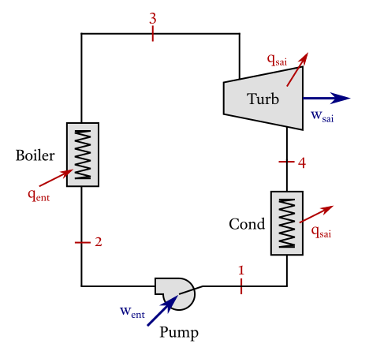

# Ideal Simple Rankine Cycle

!!! note "Cycle data"
    >  

    !!! ukw "Known properties"
        - Temperature at the boiler outlet 250 °C;
        - Pressure before turbine 1000 kPa;
        - Pressure after turbine 10 kPa.


!!! compat "Input code"
    ```julia
    CycleSolver.@solve begin
        st3.T = 250 + 273
        st3.p = 1000
        st1.p = 10

        newCycle[]
            pump(st1, st2)
            boiler(st2, st3)
            turbine(st3, st4)
            condenser(st4, st1) 
    end

    CycleSolver.PrintResults()
    ```

