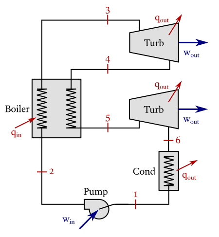

# Rankine cycle with reheat

!!! note "Cycle data"
    >  

    !!! ukw "Known properties"
        - Water is used as working fluid;
        - Pressure at the outlet of the low pressure turbine of 10 kPa;
        - Pressure at the outlet of the high pressure turbine of 200 kPa;
        - Pressure at the pump outlet of 1000 kPa;
        - Temperatures after leaving the boiler of 250 °C;
        - The pump has an isentropic efficiency of 90%;
        - The turbines have an isentropic efficiency of 80%.


!!! compat "Input code"
    ```julia
    CycleSolver.@solve begin
        st3.T = 250 + 273
        st5.T = 250 + 273
        st3.p = 1000
        st5.p = 200
        st1.p = 10

        newCycle[]
            pump(st1, st2, 90)
            boiler(st2, st3)
            turbine(st3, st4, 80)
            boiler(st4, st5)
            turbine(st5, st6, 80)
            condenser(st6, st1) 
    end

    CycleSolver.PrintResults()
    ```

