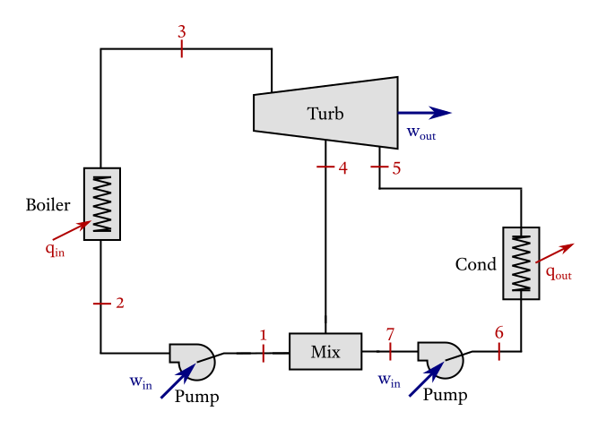

# Regenerative Rankine Cycle

!!! note "Cycle data"
    >  

    !!! ukw "Known properties"
        - Water is used as working fluid;
        - Pressure passing through the condenser of 10 kPa;
        - Pressure going to the mixing chamber of 100 kPa;
        - Boiler pressure of 1000 kPa;
        - Temperatures after leaving the boiler of 250 °C.


!!! compat "Input code"
    ```julia
    CycleSolver.@solve begin
        st3.T = 250 + 273
        st3.p = 1000
        st4.p = 100
        st5.p = 10
        
        newCycle[]
            pump(st1, st2)
            boiler(st2, st3)
            turbine(st3, [st4, st5])
            condenser(st5, st6)
            pump(st6, st7)
            heater_open([st7, st4], st1)
    end

    CycleSolver.PrintResults()
    ```

