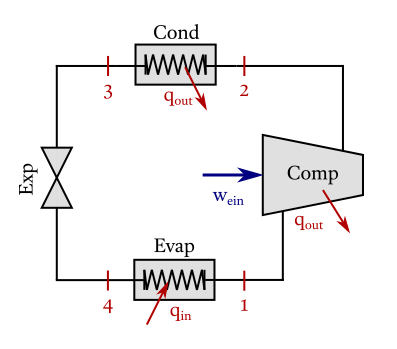

# Refrigeration cycle

!!! note "Cycle data"
    >  

    !!! ukw "Known properties"
        - Refrigerant-134a is used as working fluid;
        - Pressure at the compressor inlet 300 kPa;
        - Pressure at the compressor outlet 1500 kPa;
        - The compressor has an isentropic efficiency of 90%.


!!! compat "Input code"
    ```julia
    CycleSolver.@solve begin
        st1.p = 300
        st2.p = 1500
        newRefrigerationCycle[R134a]
            compressor(st1, st2, 90)
            condenser(st2, st3)
            expansion_valve(st3, st4)
            evaporator(st4, st1)
    end

    CycleSolver.PrintResults()
    ```

