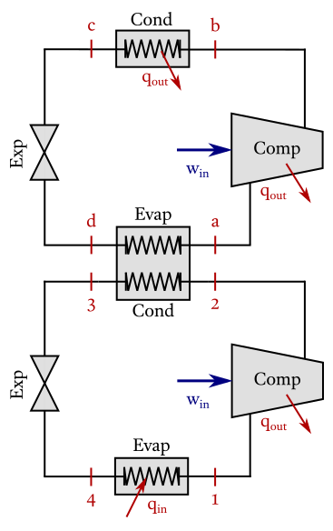

# Cascade cooling system

!!! note "Cycle data"
    >  

    !!! ukw "Known properties"
        - Refrigerant-134a is used as working fluid in both cycles;
        - The lower cycle has a mass flow of 2.5 kg/s;
        - The pressure at the inlet of the lower compressor is 250 kPa, and 600 kPa at its outlet;
        - The pressure at the inlet of the upper compressor is 500 kPa, and 1500 kPa at its outlet;
        - The upper compressor has an isentropic efficiency of 80%, and the lower one of 90%.


!!! compat "Input code"
    ```julia
    CycleSolver.@solve begin

        evaporator_condenser([stD, st2], [stA, st3])

        stA.p = 500
        stB.p = 1500
        newRefrigerationCycle[R134a]
            compressor(stA, stB, 80)
            condenser(stB, stC)
            expansion_valve(stC, stD)
            
        st1.p = 250
        st2.p = 600
        newRefrigerationCycle[R134a: 2.5]
            compressor(st1, st2, 90)
            expansion_valve(st3, st4)
            evaporator(st4, st1)
            
    end

    CycleSolver.PrintResults()
    ```

